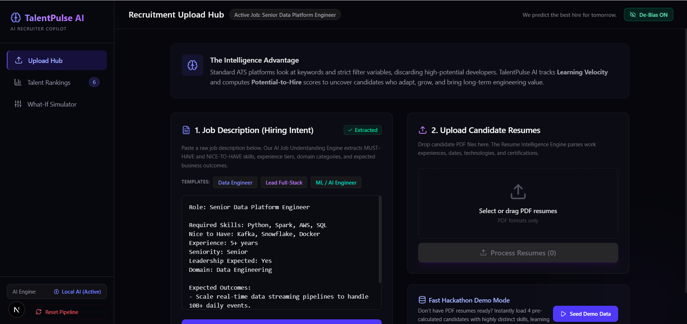
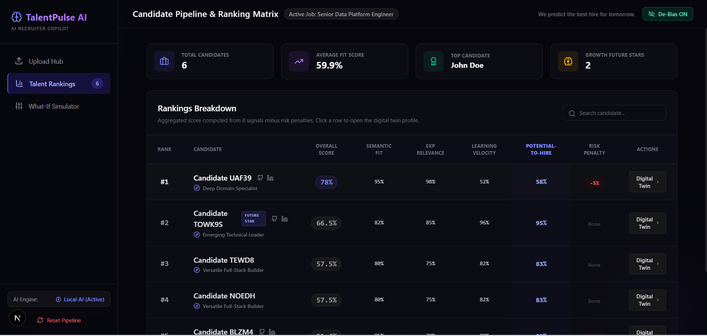
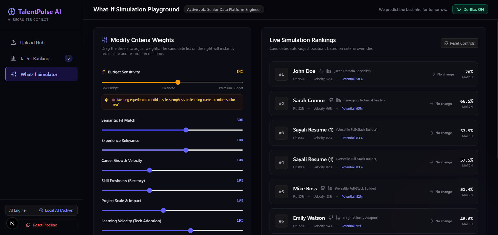

# 🧠 TalentPulse AI

> **AI-Assisted Candidate Ranking for Smarter Hiring**

TalentPulse AI is an AI-powered recruitment assistant that helps recruiters evaluate candidates by analyzing job descriptions and resumes using AI. It generates explainable candidate rankings based on multiple evaluation factors instead of relying only on keyword matching.

---

## 📖 Overview

Recruiters often receive hundreds of resumes for a single job opening. Traditional Applicant Tracking Systems (ATS) primarily rely on keyword matching, which may overlook qualified candidates with relevant skills expressed differently.

TalentPulse AI addresses this challenge by combining AI-powered document understanding with a transparent scoring system that considers multiple aspects of a candidate's profile.

---

## ✨ Features

- 📄 Intelligent Job Description Analysis
- 📑 Resume Parsing and Information Extraction
- 🤖 AI-Assisted Candidate Evaluation
- 📊 Explainable Candidate Ranking
- 🎛️ Interactive What-If Simulator
- 📈 Learning Velocity Assessment
- ⭐ Potential-to-Hire Score
- 🔍 Skill Gap Analysis

---

## 🚀 Workflow

```
Recruiter Uploads Job Description
            │
            ▼
      AI Extracts Requirements
            │
            ▼
     Candidate Resume Upload
            │
            ▼
      Resume Information Parser
            │
            ▼
     Candidate Feature Extraction
            │
            ▼
       Multi-Factor Scoring
            │
            ▼
      Candidate Ranking Dashboard
            │
            ▼
      What-If Simulation
```

---

## 📊 Candidate Evaluation

TalentPulse AI evaluates candidates using multiple signals including:

- Semantic Skill Match
- Experience Relevance
- Career Growth
- Learning Velocity
- Skill Freshness
- Project Impact
- Behavioral Indicators
- Risk Factors

The final recommendation is generated using a weighted scoring model to provide transparent and explainable results.

---

## 🎛️ What-If Simulator

Recruiters can customize hiring priorities by adjusting the weight of different evaluation criteria such as:

- Skills
- Experience
- Learning Velocity
- Project Impact

Candidate rankings update instantly, allowing recruiters to explore different hiring strategies.

---

## 🛠️ Tech Stack

### Frontend

- Next.js
- TypeScript
- Tailwind CSS
- Recharts

### Backend

- FastAPI
- Python
- SQLAlchemy
- SQLite

### AI & APIs

- OpenAI API
- Google Gemini API
- GitHub API

---

## 📷 Screenshots

### Upload Hub

Upload Job Description and Candidate Resumes.



---

### Talent Rankings

AI-generated candidate rankings with explainable scores.



---

### What-If Simulator

Adjust evaluation criteria and compare candidate rankings in real time.



---

## 📂 Project Structure

```
TalentPulse-AI/
│
├── frontend/
│   ├── app/
│   ├── components/
│   ├── public/
│   └── package.json
│
├── backend/
│   ├── app/
│   ├── models/
│   ├── services/
│   ├── database.py
│   └── main.py
│
├── screenshots/
├── README.md
└── requirements.txt
```

---

## ⚙️ Installation

### Clone Repository

```bash
git clone https://github.com/your-username/TalentPulse-AI.git
```

### Frontend

```bash
cd frontend
npm install
npm run dev
```

### Backend

```bash
cd backend

python -m venv venv

# Windows
venv\Scripts\activate

# Linux/macOS
source venv/bin/activate

pip install -r requirements.txt

uvicorn main:app --reload
```

---

## 🎯 Future Improvements

- Interview Question Generation
- AI Resume Feedback
- Team Compatibility Analysis
- Recruiter Analytics Dashboard
- Integration with Additional Professional Platforms

---

## 👥 Team

Developed as part of a National-Level Hackathon project to explore AI-assisted candidate screening and explainable recruitment workflows.

---

## 📄 License

This project is developed for educational and hackathon purposes.

---

## ⭐ Acknowledgements

- OpenAI
- Google Gemini
- FastAPI
- Next.js
- Tailwind CSS
